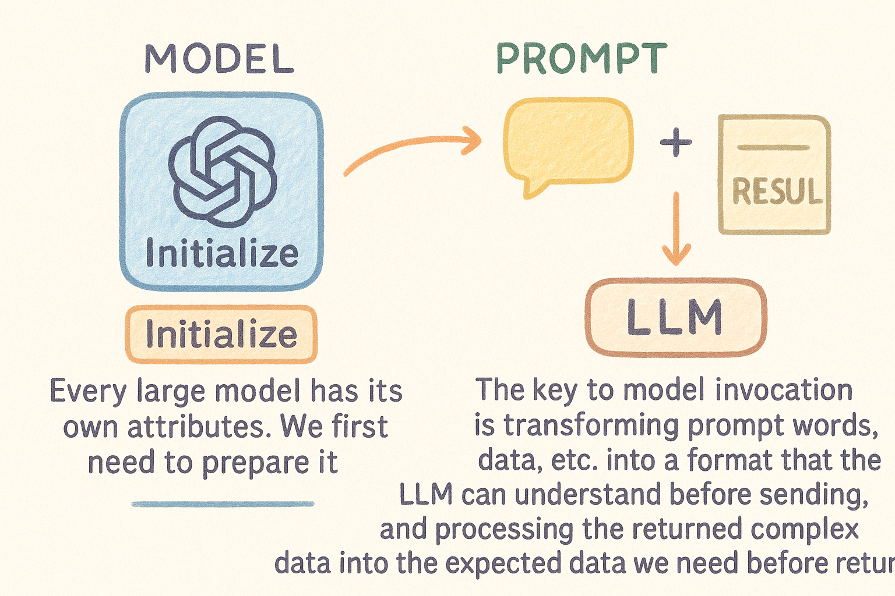

## 📥 运行入口与初始化

LangChain 没有单一的绝对入口，通过导入相应的模块来运行。
一个典型的使用流程：
```python
from langchain.llms import OpenAI
from langchain.prompts import PromptTemplate
from langchain.chains import LLMChain
  
# 初始化语言模型
llm = OpenAI(temperature=0.9)

# 创建提示模板
prompt = PromptTemplate(
    input_variables=["product"],
    template="What is a good name for a company that makes {product}?",
)

# 创建链
chain = LLMChain(llm=llm, prompt=prompt)

# 运行链
result = chain.run(product="colorful socks")
```

来逐步解析各个核心组件的初始化和调用逻辑。

## 🔍 语言模型 (LLM) 初始化与调用

### 一、初始化流程

创建一个 LLM 实例时，实际发生了以下调用：
1. 调用 `OpenAI` 类的构造函数
2. 该函数继承自 `BaseLLM`，`BaseLLM`又继承自 `BaseLanguageModel`
3. 在 `BaseLanguageModel` 中设置基础属性（如 cache、callbacks 等）
代码路径：`libs/core/langchain_core/language_models/base.py`
```python
class BaseLanguageModel(RunnableSerializable[LanguageModelInput, LanguageModelOutputVar], ABC):
    """所有语言模型的抽象基类"""
    cache: Union[BaseCache, bool, None] = Field(default=None, exclude=True)
    verbose: bool = Field(default_factory=_get_verbosity, exclude=True, repr=False)
    callbacks: Callbacks = Field(default=None, exclude=True)
    tags: Optional[list[str]] = Field(default=None, exclude=True)
    metadata: Optional[dict[str, Any]] = Field(default=None, exclude=True)
    custom_get_token_ids: Optional[Callable[[str], list[int]]] = Field(default=None, exclude=True)
```

### 二、调用流程
当使用 LLM 生成文本时（如 `llm("What is the capital of France?")`）：
1. 首先会调用 `BaseLanguageModel.invoke` 方法
2. 该方法会将输入转换为 `PromptValue`
3. 然后调用 `generate_prompt` 方法
4. `generate_prompt` 方法会调用特定 LLM 实现的 API 接口（如 OpenAI API）
5. 返回的结果会被处理并返回给用户
### invoke方法核心逻辑如下
```python
return (
    self.generate_prompt(
        [self._convert_input(input)],
        stop=stop,
        callbacks=config.get("callbacks"),
        tags=config.get("tags"),
        metadata=config.get("metadata"),
        run_name=config.get("run_name"),
        run_id=config.pop("run_id", None),
        **kwargs,
    )
    .generations[0][0]
    .text
)
```
1.  **调用 `self.generate_prompt(...)`**
    - 这是调用模型生成文本的关键方法。
    - 先把传入的提示词 `input`（`generate_prompt` 方法支持批量输入） 转换成模型能理解的格式；这一步很重要，不同模型或链条，输入格式可能不同，所以要统一处理。
     - 传入了转换好的输入、停止词、回调、标签、元数据、运行名称和 ID，以及额外参数。
2.  **调用`.generations.text`**
    - `generate_prompt` 返回的结果是一个复杂对象，因此通过`.generations[0][0]` 取第一个输入的第一个生成结果。
    - `.text` 则是最终的纯文本内容。

模型是根据不同的大模型属性（如openai）来完成初始化。模型的调用关键是将提示词、数据等等数据转化成LLM能够理解的格式再发送，并将返回的复杂数据处理成我们要的预期数据再返回。