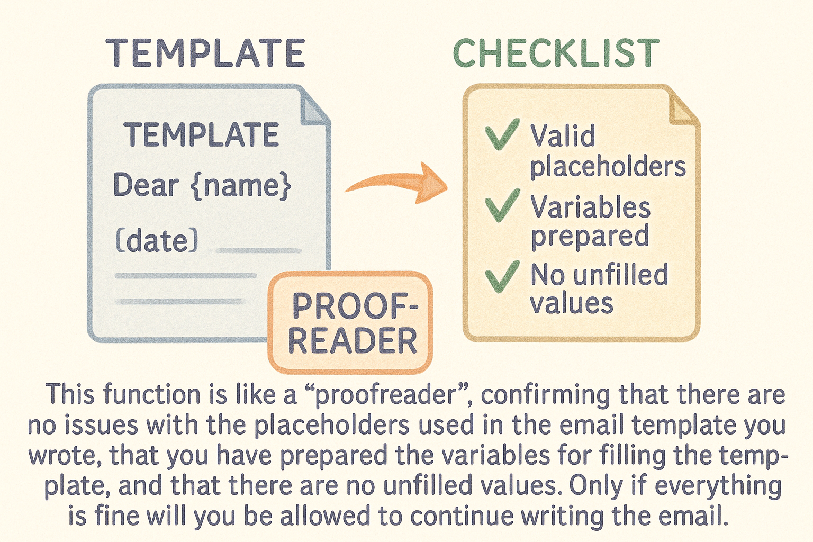

一个典型langchain的使用流程：
```python
from langchain.llms import OpenAI
from langchain.prompts import PromptTemplate
from langchain.chains import LLMChain
  
# 初始化语言模型
llm = OpenAI(temperature=0.9)

# 创建提示模板
prompt = PromptTemplate(
    input_variables=["product"],
    template="What is a good name for a company that makes {product}?",
)

# 创建链
chain = LLMChain(llm=llm, prompt=prompt)

# 运行链
result = chain.run(product="colorful socks")
```

我们来看下`PromptTemplate`是怎么工作的



## 📝 提示模板 (PromptTemplate) 初始化与调用

### 一、初始化

当创建一个提示模板时（如 `PromptTemplate(input_variables=["product"], template="What is a good name for a company that makes {product}?")`）：
1. 调用 `PromptTemplate` 类的构造函数
2. 验证模板字符串中的变量与 `input_variables` 是否匹配
3. 存储模板和变量信息
代码路径：`libs/core/langchain_core/prompts/prompt.py`
```python
class PromptTemplate(StringPromptTemplate):

    @model_validator(mode="before")
    @classmethod
    def pre_init_validation(cls, values: dict) -> Any:
        """Check that template and input variables are consistent."""
        if values.get("template") is None:
            # Will let pydantic fail with a ValidationError if template
            # is not provided.
            return values

        # Set some default values based on the field defaults
        values.setdefault("template_format", "f-string")
        values.setdefault("partial_variables", {})

        ......
```


```python
if values.get("template") is None:
    # 如果没有提供模板，直接返回，不做后续检查
    return values
```
- 若没有传入模板，函数不处理，直接返回。


```python
values.setdefault("template_format", "f-string")
values.setdefault("partial_variables", {})
```
- 给 `template_format` 设置默认Python 风格的格式化字符串 `"f-string"。
- 给 `partial_variables` 预先填充空字典。


```python
all_inputs = values["input_variables"] + list(values["partial_variables"])
check_valid_template(values["template"], values["template_format"], all_inputs)
```
- 将所有输入变量和其他地方的变量合并成一个列表待后续使用。
- 调用 `check_valid_template` 函数，`check_valid_template` 是一个**模板校验器**，检查模板里的变量和传入的变量是否匹配

```python
if values["template_format"]:
    values["input_variables"] = [
        var
        for var in get_template_variables(values["template"], values["template_format"])
        if var not in values["partial_variables"]
    ]
```
- 根据模板内容和格式，提取模板中需要的变量名。
- 过滤已经在 `partial_variables` 里预先填充的变量。
- 最终更新 `input_variables`，保证只包含真正需要用户输入的变量。
#### 简单比喻
想象你要写一封邮件模板，里面有“{name}”、“{date}”这样的占位符。这个函数就像一个“校对员”，它会：
- 确认你写的模板里用的占位符有没有问题。
- 确认你准备好给模板填充的变量了。
- 自动帮你挑出哪些变量还没填。
- 如果一切没问题，才让你继续写邮件。


### 二、调用流程

当格式化提示模板时（如 `prompt.format(product="colorful socks")`）：
1. 调用 `PromptTemplate.format` 方法
2. 该方法会检查所有必需的变量是否都提供了
3. 然后使用提供的变量格式化模板字符串
4. 返回格式化后的字符串
