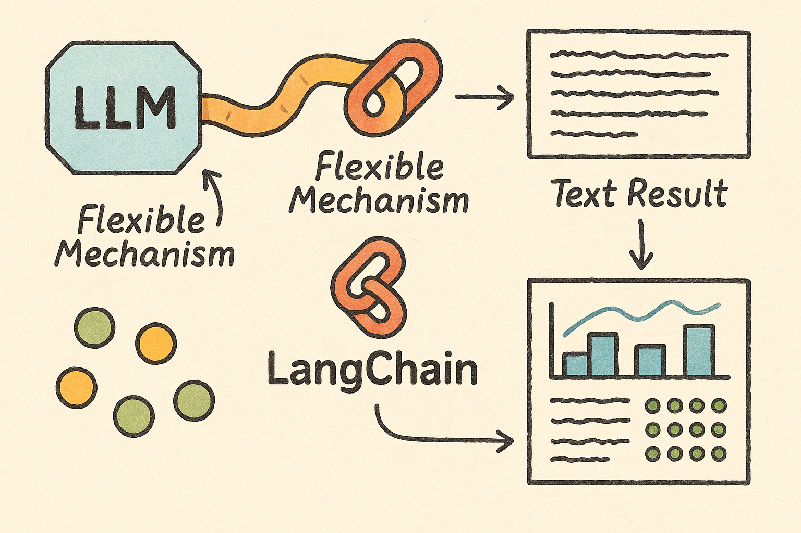

一个典型langchain的使用流程：
```python
from langchain.llms import OpenAI
from langchain.prompts import PromptTemplate
from langchain.chains import LLMChain
  
# 初始化语言模型
llm = OpenAI(temperature=0.9)

# 创建提示模板
prompt = PromptTemplate(
    input_variables=["product"],
    template="What is a good name for a company that makes {product}?",
)

# 创建链
chain = LLMChain(llm=llm, prompt=prompt)

# 运行链
result = chain.run(product="colorful socks")
```

我们来看下`Chain`是怎么工作的



## ⛓️ 链 (Chain) 初始化与调用

### 一、初始化
  
当创建一个链时（如 `LLMChain(llm=llm, prompt=prompt)`）：
1. 首先调用 `LLMChain` 类的构造函数
2. 该构造函数继承自 `Chain` 基类
3. 存储 LLM 和提示模板实例
代码路径：`libs/langchain/langchain/chains/llm.py`
```python

class LLMChain(Chain):

    """使用语言模型的链"""
    prompt: BasePromptTemplate
    llm: BaseLanguageModel
    output_key: str = "text"
    output_parser: Optional[BaseOutputParser] = None
    return_final_only: bool = True

```
  
### 二、调用chain的流程
当运行一个链时（如 `chain.run(product="colorful socks")`）：
1. `run` 方法是 `__call__` 方法的便捷包装，实际上会调用 `_call` 方法
2. 核心为`generate()`生成llm对应的prompt与`self.create_outputs(response)`生成llm的输出结果
代码路径：`libs/langchain/langchain/chains/base.py`

```python
def _call(
        self,
        inputs: dict[str, Any],
        run_manager: Optional[CallbackManagerForChainRun] = None,
    ) -> dict[str, str]:
        response = self.generate([inputs], run_manager=run_manager)
        return self.create_outputs(response)[0]
```
2. 在 `LLMChain` 中，`_call` 方法会：
   a. 使用提示模板格式化输入
   b. 将格式化后的提示传递给 LLM
   c. 处理 LLM 的输出并返回
```python
def generate(
        self,
        input_list: list[dict[str, Any]],
        run_manager: Optional[CallbackManagerForChainRun] = None,
    ) -> LLMResult:

        """Generate LLM result from inputs."""
        prompts, stop = self.prep_prompts(input_list, run_manager=run_manager)
        callbacks = run_manager.get_child() if run_manager else None
        if isinstance(self.llm, BaseLanguageModel):
            return self.llm.generate_prompt(
                prompts,
                stop,
                callbacks=callbacks,
                **self.llm_kwargs,
            )
        else:
            results = self.llm.bind(stop=stop, **self.llm_kwargs).batch(
                cast(list, prompts), {"callbacks": callbacks}
            )
            generations: list[list[Generation]] = []
            for res in results:
                if isinstance(res, BaseMessage):
                    generations.append([ChatGeneration(message=res)])
                else:
                    generations.append([Generation(text=res)])
            return LLMResult(generations=generations)
```

- 整理提示词：遍历每个输入字典，取出所需遍历填充到模板中，得到最终的提示词列表。
- 生成结果：将整理好的提示词列表传给实际LLM处理后返回结果，`batch`表示以批处理方式调用 LLM；且判断llm为老版本则丢给老代码处理（为了兼容版本）。


```python
def create_outputs(self, llm_result: LLMResult) -> list[dict[str, Any]]:

        """Create outputs from response."""
        result = [
            # Get the text of the top generated string.
            {
                self.output_key: self.output_parser.parse_result(generation),
                "full_generation": generation,
            }
            for generation in llm_result.generations
        ]
        if self.return_final_only:
            result = [{self.output_key: r[self.output_key]} for r in result]
        return result
```
- 整理LLM回答：取出LLM的原始回答内容`llm_result`，此处可能多个（例如问了三个问题就会返回三个回答），并且将原始结果转化我们想要的形式（原始结果可能是个复杂的答案对象）。
- 判断输出形式：决定最终返回的结果是“精简版”还是“完整版”。

##### 简单理解
create_outputs函数就是**流水线末端的包装工**：
1. 它拿到LLM吐出来的“半成品”答案（`llm_result.generations`）。
2. 通过“加工工具”（`output_parser`）将每个“半成品”加工成我们需要的“成品”文本，并把原始的“半成品”也进行备份。
3. 接下来，它看一眼“订单要求”（`self.return_final_only`）：
    - 若订单要求“只出成品”，它就丢掉保留的“半成品”，把“成品”装箱。
    - 若订单要求“成品和半成品都要”，则把所有东西都装箱。
4. 最后，把装箱的“产品”（整理后的字典列表）交出去。

### 三、总结：

langchain为我们提供了一个**灵活的机制**，能够控制从LLM 获取到的原始数据最终以什么形式呈现给出来，是只输出最终的文本结果，还是需要更多的原始生成信息。