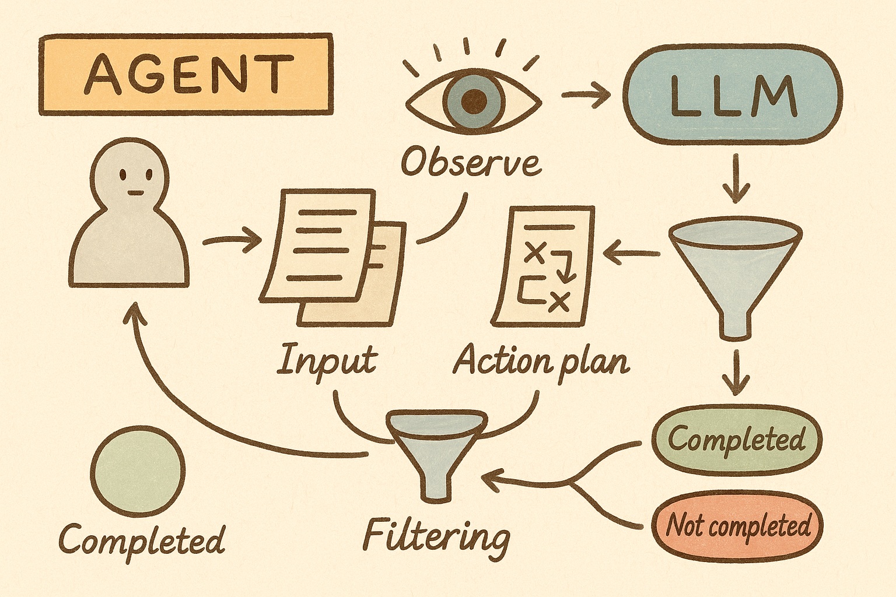

一个典型langchain的使用流程：
```python
from langchain.llms import OpenAI
from langchain.prompts import PromptTemplate
from langchain.chains import LLMChain
  
# 初始化语言模型
llm = OpenAI(temperature=0.9)

# 创建提示模板
prompt = PromptTemplate(
    input_variables=["product"],
    template="What is a good name for a company that makes {product}?",
)

# 创建链
chain = LLMChain(llm=llm, prompt=prompt)

# 运行链
result = chain.run(product="colorful socks")
```

我们来看下`Agent`是怎么工作的




## 🤖 代理 (Agent) 初始化与调用
### 一、初始化

代理的初始化通常通过工厂方法完成，如 `initialize_agent(tools, llm, agent="zero-shot-react-description")`：
1. `initialize_agent` 函数会根据指定的代理类型创建代理实例
2. 创建代理时会设置工具、LLM 和输出解析器
3. 最后创建 `AgentExecutor` 实例，它负责执行代理的决策循环
代码路径：`libs/langchain/langchain/agents/initialize.py`
```python

def initialize_agent(

    tools: Sequence[BaseTool],
    llm: BaseLanguageModel,
    agent: Optional[Union[Agent, AgentType]] = None,
    # ... 其他参数 ...
) -> AgentExecutor:

    """Initialize an agent."""
    # 根据agent类型创建具体的代理实例
    # ...
    return AgentExecutor.from_agent_and_tools(
        agent=_agent,
        tools=tools,
        callback_manager=callback_manager,
        # ... 其他参数 ...
    )

```

  
### 二、调用流程

当运行代理时（如 `agent_executor.run("Find the capital of France")`）：
1. `run` 方法调用 `__call__` 方法，后者调用 `invoke` 方法
2. `invoke` 方法会调用 `_call` 方法
3. 在 `AgentExecutor` 中，`_call` 方法实现了代理的决策循环：
   a. 代理观察环境状态并决定下一步行动
   b. 如果代理决定使用工具，则执行工具操作
   c. 将工具的输出作为观察结果返回给代理
   d. 重复上述过程，直到代理决定完成任务
代码路径：`libs/langchain/langchain/agents/agent.py`
```python
def _call(
    self,
    inputs: dict[str, str],
    run_manager: Optional[CallbackManagerForChainRun] = None,
) -> dict[str, Any]:

    """运行代理的决策循环"""
    # 准备工具（映射）
    name_to_tool_map = {tool.name: tool for tool in self.tools}
    # 准备颜色（映射，用于日志显示）
    color_mapping = get_color_mapping([tool.name for tool in self.tools])
    # 初始化中间要执行的步骤
    intermediate_steps: list[tuple[AgentAction, str]] = []
    # 记录开始执行的时间
    time_elapsed = 0.0
    start_time = time.time()
    # 决策循环
    iterations = 0
    # 检测是否超过最大任务执行次数或者超过最大任务执行时间
    while self._should_continue(iterations, time_elapsed): 
        iterations += 1
        # 调用代理决定下一步行动
        # 执行行动并获取结果
        # 更新中间步骤
        # 检查是否完成
        # ...
        time_elapsed = time.time() - start_time

    # 处理结果并返回

    # ...

```

##### 如何决定下一步的函数？
```python
def _take_next_step(

        self,
        name_to_tool_map: dict[str, BaseTool],    # 可以使用的工具
        color_mapping: dict[str, str],
        inputs: dict[str, str],    # 初始的输入
        intermediate_steps: list[tuple[AgentAction, str]],    # 前面之前已经执行过的步骤和结果
        run_manager: Optional[CallbackManagerForChainRun] = None,    # 任务管理器，用于记录过程    
    ) -> Union[AgentFinish, list[tuple[AgentAction, str]]]:

         # 核心逻辑
        return self._consume_next_step(
            [
                a
                for a in self._iter_next_step(
                    name_to_tool_map,
                    color_mapping,
                    inputs,
                    intermediate_steps,
                    run_manager,)
            ]
        )
```
- 核心逻辑是将从 `_iter_next_step` 思考出来的所有可能的“下一步行动” 传递给`_consume_next_step`进行检测过滤。

##### 如何获取“下一步行动”？
```python
def _iter_next_step(

        self,
        name_to_tool_map: dict[str, BaseTool],    # 可以使用的工具
        color_mapping: dict[str, str],
        inputs: dict[str, str],    # 初始的输入
        intermediate_steps: list[tuple[AgentAction, str]],    # 前面之前已经执行过的步骤和结果
        run_manager: Optional[CallbackManagerForChainRun] = None,    # 任务管理器，用于记录过程    
    ) -> Iterator[Union[AgentFinish, AgentAction, AgentStep]]:
        """Take a single step in the thought-action-observation loop.
        Override this to take control of how the agent makes and acts on choices.
        """
        try:
            intermediate_steps = self._prepare_intermediate_steps(intermediate_steps)    # 整理前面的步骤
            # Call the LLM to see what to do.
            output = self._action_agent.plan(
                intermediate_steps,
                callbacks=run_manager.get_child() if run_manager else None,
                **inputs,
            )    # 将整理好的内容发送LLM
        except OutputParserException as e:
            if isinstance(self.handle_parsing_errors, bool):  
                raise_error = not self.handle_parsing_errors
            else:
                raise_error = False
            if raise_error:
                raise ValueError(
                    "An output parsing error occurred. "
                    "In order to pass this error back to the agent and have it try "
                    "again, pass `handle_parsing_errors=True` to the AgentExecutor. "
                    f"This is the error: {str(e)}"
                )

            text = str(e)
            if isinstance(self.handle_parsing_errors, bool):
                if e.send_to_llm:
                    observation = str(e.observation)
                    text = str(e.llm_output)
                else:
                    observation = "Invalid or incomplete response"
            elif isinstance(self.handle_parsing_errors, str):
                observation = self.handle_parsing_errors
            elif callable(self.handle_parsing_errors):
                observation = self.handle_parsing_errors(e)
            else:
                raise ValueError("Got unexpected type of `handle_parsing_errors`")
            output = AgentAction("_Exception", observation, text)
            if run_manager:
                run_manager.on_agent_action(output, color="green")
            tool_run_kwargs = self._action_agent.tool_run_logging_kwargs()
            observation = ExceptionTool().run(
                output.tool_input,
                verbose=self.verbose,
                color=None,
                callbacks=run_manager.get_child() if run_manager else None,
                **tool_run_kwargs,
            )
            yield AgentStep(action=output, observation=observation)
            return

  
        if isinstance(output, AgentFinish):  # 任务完成，返回最终结果
            yield output
            return
  
        actions: list[AgentAction]
        if isinstance(output, AgentAction):
            actions = [output]
        else:
            actions = output
        for agent_action in actions:
            yield agent_action
        for agent_action in actions:
            yield self._perform_agent_action(
                name_to_tool_map, color_mapping, agent_action, run_manager
            )
```
1. 通过`self._prepare_intermediate_steps(intermediate_steps)`整理执行过的**所有行动**
2. `self._action_agent.plan`中封装了与 **大型语言模型（LLM）** 的交互逻辑，将**整理好的历史步骤**（`intermediate_steps`）、**原始问题**（`inputs`）以及**所有可用的工具信息**（并在`_action_agent` 内部转换为 LLM 能理解的格式）发送给 LLM处理。
3. 分析LLM返回结果`若任务完成，直接返回最终结果`。
   - 若任务完成，直接返回最终结果。
   - 若任务未完成：
    -  首先 `yield agent_action` 汇报**后续的行动计划**。
    -  再`yield self._perform_agent_action(...)` 汇报完开始**执行**后续的行动计划。


##### 如何对后续的行动计划进行检查？
```python
def _consume_next_step(
        self, values: NextStepOutput
    ) -> Union[AgentFinish, list[tuple[AgentAction, str]]]:
        if isinstance(values[-1], AgentFinish):    # 检查行动计划的最后一项是不是“AgentFinish”
            assert len(values) == 1
            return values[-1]
        else:
            return [
                (a.action, a.observation) for a in values if isinstance(a, AgentStep)
            ]    # 检查行动计划
```
1. 行动计划的最后一项是“AgentFinish”
   - 如果是“AgentFinish”，要确保报告里只有这一项（不应该有其他行动了）。
   - 直接返回“AgentFinish”的信号。
2. 过滤出合法的“行动步骤”，只提取出行动本身和观察到的结果`a.action, a.observation`并返回。

### 三、总结

其实并不复杂，Agent完成初始化后，首先观察环境，然后将输入与行动计划传给LLM规划下一步的行动，在获取到LLM返回的行动计划后，进行过滤判断是否执行完毕；若未完成则重复前面的过程直到完成任务。